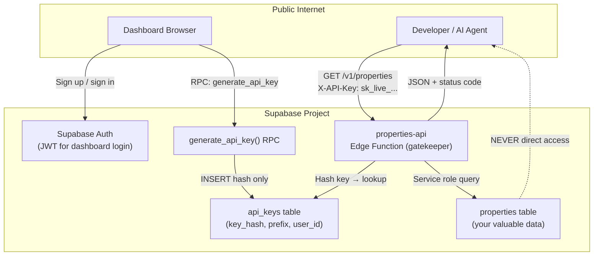

# Build a Profitable API: Complete Implementation Playbook

**Source:** [Build a Profitable API Like a $10M Company (full guide / beginner friendly)](https://www.youtube.com/watch?v=Un2F0VeN-pE) by Oliver (formerly Response AI)  
**Extended reference:** [roswell.dev](https://roswell.dev) — Idea to Exit playbook, SQL, Edge Function code, dashboard prompts  
**Stack:** Supabase (PostgreSQL + Edge Functions + Auth), Cursor (frontend), optional Vercel (deploy)

---

## Executive Summary

The gap between a weekend script and a product developers pay for is not the data — it is the **access layer**: permanent API keys, hashed storage, a server-side gatekeeper, and API design that respects how developers integrate.

**Core thesis:** Take any table of proprietary data and wrap it in a paid public API where customers sign up, generate keys, and pay per call (e.g., 10,000 calls/month for $20). The same architecture works whether the data is fictional haunted houses or real Texas real-estate listings with pricing and sale history.

**What you will build:**

| Layer | Responsibility |
|-------|----------------|
| `properties` table | The valuable data customers pay to access |
| `api_keys` table | Fingerprints (hashes) of customer keys — never plaintext keys |
| `generate_api_key()` RPC | Server-side key minting; raw key shown exactly once |
| `properties-api` Edge Function | The only public entry point; validates keys and returns filtered data |
| Auth + dashboard | Logged-in users mint, name, copy-once, list (prefix only), and revoke keys |

**Three properties that separate toy from product:**

1. **Zero-knowledge key storage** — You never store raw keys; liability stays with the customer if they leak their key.
2. **Instant revocation** — Delete a key row; the gatekeeper rejects it on the next request.
3. **Total isolation** — Public traffic never touches raw database credentials; only the Edge Function is exposed.

---

## Table of Contents

1. [Business Context & Monetization Model](#1-business-context--monetization-model)
2. [System Architecture](#2-system-architecture)
3. [Why Not Supabase's Built-in Keys](#3-why-not-supabases-built-in-keys)
4. [Mental Model: The VIP Nightclub](#4-mental-model-the-vip-nightclub)
5. [Part 1: The Key System](#5-part-1-the-key-system)
6. [Part 2: API Product Design](#6-part-2-api-product-design)
7. [Part 3: Security & Hardening](#7-part-3-security--hardening)
8. [Request Lifecycle (End-to-End Trace)](#8-request-lifecycle-end-to-end-trace)
9. [Customer Key Acquisition Options](#9-customer-key-acquisition-options)
10. [Frontend Dashboard Specification](#10-frontend-dashboard-specification)
11. [Testing & Validation](#11-testing--validation)
12. [Documentation as Onboarding](#12-documentation-as-onboarding)
13. [Implementation Checklist](#13-implementation-checklist)
14. [AI Agent Instructions](#14-ai-agent-instructions)
15. [Quick Reference Tables](#15-quick-reference-tables)

---

## 1. Business Context & Monetization Model

### Why APIs over traditional SaaS

- **Long-term stickiness:** Developers embed API keys in production code. Switching costs are engineering hours, not UI preference.
- **Recurring revenue:** Usage-based pricing (per call, per credit, per document) scales with customer success.
- **AI-agent economy:** Autonomous agents call APIs; they do not browse dashboards. API-first products become default building blocks for agent workflows.
- **Real examples cited:** Posties (~$60k/month social posting API), Screenshot One (URL-to-screenshot), Resend (email API), YouTube Transcript API (freemium tiers).

### The data-to-revenue pattern

```
Proprietary data you own
  → Public REST API with key auth
  → Developer signs up / pays
  → Generates permanent API key
  → Pays per call or monthly quota
  → You monetize the same table indefinitely
```

**Example in the video:** A `properties` table with fictional haunted mansions. Replace with real estate in Texas (price, sale history, purchase history) and a Texas real-estate agent pays for access.

### Typical pricing shape

| Tier | Example |
|------|---------|
| Free | 10 requests/day or 10,000/month cap |
| Paid | Unlimited or 10,000/month for ~$9–$20 |
| Enterprise | Higher rate limits, SLA, dedicated support |

Rate limits and quotas are **product features**, not afterthoughts — they define what you sell.

---

## 2. System Architecture



### Component responsibilities

| Component | Who touches it | Must never |
|-----------|----------------|------------|
| `properties` table | Edge Function (service role) | Be queried directly by customers |
| `api_keys` table | RPC (insert hash), Edge Function (lookup), Dashboard (RLS-scoped list/delete) | Store plaintext keys |
| `generate_api_key()` | Dashboard via `supabase.rpc()` | Run in browser/front-end |
| Edge Function | All external API traffic | Expose `service_role` key to client |
| Dashboard | Authenticated users only | Display full key after creation modal |

### Supabase project setup (from video)

When creating the project:

- Enable **Data API**
- Enable **automatic RLS** on new tables
- Choose region (e.g., Europe)
- Store database password securely

---

## 3. Why Not Supabase's Built-in Keys

Supabase auto-generates a REST API for every table, but it authenticates with **JWTs** — temporary tokens (like a festival wristband that expires in ~1 hour).

| | Supabase JWT | Custom API Key |
|--|--------------|----------------|
| **Lifetime** | Short-lived (~1 hour) | Permanent until revoked |
| **Use case** | User logged into browser/app | Developer embedding in server code |
| **Rotation** | Auto-refresh | Customer manages; you revoke |
| **Billing model** | Wrong fit for per-call APIs | Correct fit |

**Conclusion:** Supabase has no built-in permanent per-customer API key table. You build one yourself — less work than it sounds.

---

## 4. Mental Model: The VIP Nightclub

Use this metaphor when implementing or explaining the system:

| Concept | Nightclub analogy | Technical mapping |
|---------|-------------------|-------------------|
| Database | The club interior | PostgreSQL tables |
| Customer | VIP guest | Developer with API key |
| API key | VIP badge / secret code | `sk_live_...` string |
| Clipboard with badge codes | Storing plaintext keys | **Never do this** — breach = all keys leak |
| Fingerprint of badge | One-way hash | SHA-256 of key → `key_hash` column |
| Bouncer | Checks fingerprint against list | Edge Function |
| Service role key | Master key bouncer uses | Server-side only; bypasses RLS for lookup |

**Golden rule:** The bouncer never writes down the real badge code. He stores a fingerprint. If someone steals the clipboard, they cannot reconstruct badges from fingerprints.

---

## 5. Part 1: The Key System

Three pieces, built in order: **table → generator → gatekeeper**.

### 5.1 Piece 1: The `api_keys` Table

**Store the fingerprint, never the key.**

#### Required columns (conceptual schema)

```sql
-- Conceptual schema — exact DDL in video description / roswell.dev
CREATE TABLE public.api_keys (
  id          UUID PRIMARY KEY DEFAULT gen_random_uuid(),
  user_id     UUID NOT NULL REFERENCES auth.users(id) ON DELETE CASCADE,
  name        TEXT NOT NULL,                    -- e.g. "production", "staging"
  key_hash    TEXT NOT NULL UNIQUE,             -- SHA-256 hex digest — NEVER the raw key
  prefix      TEXT NOT NULL,                    -- e.g. "sk_live_1a2b" — safe to display
  created_at  TIMESTAMPTZ DEFAULT now(),
  last_used_at TIMESTAMPTZ,
  is_active   BOOLEAN DEFAULT true
);

ALTER TABLE public.api_keys ENABLE ROW LEVEL SECURITY;

CREATE POLICY "Users see own keys"
  ON public.api_keys
  FOR ALL
  USING (auth.uid() = user_id)
  WITH CHECK (auth.uid() = user_id);
```

#### Column design rules

| Column | Purpose | Security note |
|--------|---------|---------------|
| `key_hash` | Lookup fingerprint | SHA-256 is one-way; cannot reverse to key |
| `prefix` | Dashboard display ("which key is this?") | Safe in plaintext — partial string useless alone |
| `user_id` | Ownership + RLS | `auth.uid() = user_id` on every policy |
| `name` | User-assigned label | UX only |

**Without RLS:** Any authenticated user could list everyone's key prefixes — catastrophic.

### 5.2 Piece 2: The Key Generator (`generate_api_key()`)

**Generate inside the database, never in the front-end.**

If the browser creates the key, it travels over the network to be saved — one more leak surface.

#### Flow

```
User clicks "Create key"
  → supabase.rpc('generate_api_key', { key_name: 'production' })
  → Postgres function:
       1. Generate cryptographically random string (e.g. sk_live_ + random bytes)
       2. Compute SHA-256 hash
       3. Extract prefix (first N chars)
       4. INSERT row with hash + prefix only
       5. RETURN raw key string (one time only)
  → Front-end shows copy-once modal
  → Raw key exists only in customer's clipboard after they copy
```

#### Front-end modal requirements

- Show full key **exactly once**
- Copy button
- Warning: *"Copy it now. You will never see it again."*
- This is not drama — you genuinely cannot retrieve it; only the hash remains

#### If customer loses key

They generate a new one. You never had the old one stored.

### 5.3 Piece 3: The Gatekeeper (Edge Function)

**Customers cannot talk to the database directly** — they hold a custom key, not a Supabase JWT.

Deploy an Edge Function (e.g., `properties-api`) that acts as the **only** public API surface.

#### Five-step request handling (milliseconds)

1. Read key from `X-API-Key` header (or `Authorization: Bearer <key>` — pick one, document it)
2. Hash the provided key (same algorithm as generator)
3. Query `api_keys` — does this fingerprint exist and is it active?
4. Resolve which customer owns the key
5. Query `properties` with validated filters; return JSON

#### Example: filter haunted houses in London

```
GET /v1/properties?city=London&haunted=true
X-API-Key: sk_live_abc123...
```

→ Edge Function validates key → returns only haunted London properties.

#### Service role key usage

The Edge Function uses **`SUPABASE_SERVICE_ROLE_KEY`** (server-side env only) to:

- Look up key hashes (bypasses RLS for cross-user lookup)
- Query `properties` table

**Critical:** Service role bypasses all security. It must **never** appear in browser code, front-end bundles, or client-side env vars.

#### Edge Function deployment

- Name: `properties-api` (or your resource name)
- Deploy via Supabase Edge Functions editor or CLI
- Set `verify_jwt = false` for public API endpoints — authorization moves into function body
- Full code provided in video description

### 5.4 The Data Table: `properties`

Example schema from the video:

```sql
-- Conceptual schema
CREATE TABLE public.properties (
  id            BIGSERIAL PRIMARY KEY,
  name          TEXT NOT NULL,       -- e.g. "The Wobbling Manor"
  address       TEXT,
  city          TEXT,                -- e.g. "Bath", "London"
  price         NUMERIC,
  bedrooms      INT,
  bathrooms     INT,
  square_feet   INT,
  year_built    INT,
  property_type TEXT,                -- e.g. "castle", "flat"
  has_garden    BOOLEAN,
  is_haunted    BOOLEAN,
  haunt_rating  INT,                 -- e.g. 1–5
  status        TEXT                 -- e.g. "for_sale"
);
```

Sample rows include: Wobbling Manor (Bath, castle, haunted), Suspicious Sublet (London, flat, not haunted), Mold Hall, Tilted Turret, Creaky Pines, Last Resort (Blackpool, cheapest), Soggy Bottom House (Norwich).

**RLS on `properties`:** Typically no direct public access — all reads go through Edge Function with service role.

---

## 6. Part 2: API Product Design

A working key system gets people in. **Good API design** makes them stay and keep paying.

**Gold standard:** A developer can use your API without reading docs. Every decision below serves that goal.

### 6.1 Endpoint Naming (REST conventions)

Think of a library: the shelf is `/properties`. You walk up and take a book.

| Rule | Do | Don't |
|------|-----|-------|
| Nouns for resources | `GET /properties` | `GET /get-properties` |
| HTTP method = action | `GET` reads, `POST` creates, `PUT/PATCH` updates, `DELETE` removes | Verb in URL path |
| Plurals | `/properties`, `/properties/42` | `/property` mixed with `/properties` |
| Consistent casing | Pick `snake_case` OR `camelCase` for query params — not both | Mix styles |

#### Examples

```
GET    /v1/properties           → list (with filters)
GET    /v1/properties/42        → single property
POST   /v1/properties           → create (if exposed)
DELETE /v1/properties/42        → remove
```

### 6.2 HTTP Status Codes

Return honest codes. **Never** return `200` with an error hidden in the JSON body.

| Code | Meaning | When to use |
|------|---------|-------------|
| **200** | Success | Successful read |
| **201** | Created | Resource created |
| **401** | Unauthorized | API key missing or invalid |
| **404** | Not Found | Property ID doesn't exist |
| **429** | Too Many Requests | Rate limit exceeded |
| **500** | Server Error | Your bug, not theirs |

Developers' code branches on status codes. Wrong codes → angry support emails → churn.

Reference APIs that do this well: Stripe, OpenAI, ChatGPT API.

### 6.3 Pagination, Filtering, and Sorting

**Never return everything at once.** A request for 10,000 properties is slow, expensive, and useless — and lets someone scrape your entire dataset in one call.

#### Pagination (default behavior)

```
GET /v1/properties?page=2&limit=20
```

Return a clean chunk; customer requests next page when needed.

#### Filtering (server-side)

```
GET /v1/properties?min_price=500000&haunted=true&city=London
```

Do the work in PostgreSQL; send back only what they asked for.

#### Sorting

```
GET /v1/properties?sort=price&order=asc
```

Video demo: `sort price ascending` returned Last Resort (£195,000) before Soggy Bottom House (£275,000).

**Why this matters:** Server-side filter/sort/paginate is the clearest signal a human designed the API, not a weekend script.

### 6.4 Versioning From Day One

Put version in the path from the start:

```
/v1/properties
```

In 6 months, restructure data → ship `/v2/properties` with new shape → leave `/v1` running.

**Without versioning:** Every improvement is a breaking change. Hundreds of developers' integrations break simultaneously.

Metaphor: Keep the old recipe when you change the menu. Regulars who ordered the old dish still get what they expected.

---

## 7. Part 3: Security & Hardening

Your API is a door. The key system handles **who gets in**. This section controls **what they can do inside** and keeps bad actors out.

### 7.1 Rate Limiting (non-optional)

**Analogy:** One free sample per customer. Without limits, one greedy person empties the entire tray.

Without rate limits, one user can:

- Send thousands of requests per minute
- Take your system down
- Run up your Supabase bill
- Brute-force scrape all data
- Resell your dataset and churn

#### Per-key rate limiting (video demo)

Example implementation in Edge Function:

```typescript
// Conceptual — video swaps to: if count >= 5 in 1 minute → 429
if (requestCountInLastMinute >= RATE_LIMIT) {
  return new Response(
    JSON.stringify({ error: 'rate_limit_exceeded' }),
    { status: 429, headers: corsHeaders }
  );
}
```

Video demo: **5 requests per minute per key** → 6th request returns `429`.

#### Critical gap: per-key ≠ per-user

If limits are only per-key, a user can:

1. Hit rate limit on key A
2. Generate key B in the dashboard
3. Continue scraping

**Fix:** Enforce limits at **`user_id` level** (or account level), not just `api_key_id`. Additional check: cap keys per user, or aggregate request count across all keys owned by a user.

#### Rate limit counter storage

Keep counters in a **`rate_limit_log`** table (or similar) that users **cannot edit via RLS**.

If the limit lives in a user-editable row, they change `limit: 10` to `limit: 10000000` in browser devtools and win.

#### Rate limits as product tiers

| Tier | Limit | Price |
|------|-------|-------|
| Free | 10/day | $0 |
| Starter | 10,000/month | $9 |
| Pro | Unlimited | $49 |

Per-customer limits also enable upsell when they hit `429`.

### 7.2 Input Validation & SQL Injection Prevention

**Never trust client input.**

If you concatenate user strings into SQL:

```sql
-- NEVER
"SELECT * FROM properties WHERE city = '" + userInput + "'"
```

An attacker writes the query for you via inspect-element or API manipulation.

**Fix (boring and total):**

1. Use Supabase client's parameterized methods (`.eq()`, `.gte()`, `.filter()`) — input is **data**, never **command**
2. Validate types before querying: Is `min_price` actually a number? Is `limit` within bounds?
3. A ~10-line validation block closes an entire attack category

**Related attack:** Vibe-coded apps where `isPayingCustomer: false` can be toggled to `true` in browser — same class of "never trust the client."

### 7.3 CORS (Cross-Origin Resource Sharing)

**Analogy:** Guest list at the door, but for websites.

- Only named origins can call your API from a browser
- Wrong CORS → malicious site tricks logged-in users into making requests on their behalf

#### Rules for a paid data API

| Scenario | CORS policy |
|----------|-------------|
| Customers call from **their servers** with API key | Server-to-server — CORS irrelevant |
| Customers call from **browser JS** | Strict allowlist of origins |
| Wildcard `*` on expensive/paid data | **Dangerous** |
| Public read-only free data | Wildcard may be acceptable |

**Default:** Strict. Open only what you must.

### 7.4 HTTPS Always

- HTTP = postcard (readable by anyone on the network)
- HTTPS = sealed envelope
- API key is written on the request — seal it
- Supabase provides HTTPS by default
- **Rule:** Never serve API over plain HTTP

### 7.5 Least Privilege

| Key | Where it lives | Permissions |
|-----|----------------|-------------|
| Publishable / anon | Dashboard front-end | RLS-scoped user operations only |
| Service role / secret | Edge Function env only | Full access — bypasses RLS |
| Customer API key | Customer's server | Access only what Edge Function exposes |

Metaphor: Hand the cleaner a key to the cupboard, not the whole building.

---

## 8. Request Lifecycle (End-to-End Trace)

Trace a single successful request:

```
1. Customer sends:
   GET /v1/properties?haunted=true&sort=price&order=asc
   Header: X-API-Key: sk_live_...
   Over HTTPS (encrypted in transit)

2. Edge Function receives request

3. Rate limit check
   → Count recent requests for this key/user
   → If exceeded: return 429, STOP

4. Key validation
   → Hash provided key (SHA-256)
   → Lookup key_hash in api_keys
   → If not found: return 401, STOP

5. Input validation
   → Parse & validate query params (types, bounds)
   → Reject malformed input: return 400

6. Database query (service role, server-side only)
   → SELECT from properties WHERE is_haunted = true ORDER BY price ASC
   → Apply pagination (LIMIT/OFFSET or cursor)

7. Response
   → JSON body + 200
   → Optional: X-RateLimit-Remaining header

8. Database never touched by outside world directly
```

Every checkpoint matters. Miss one → door stays open.

---

## 9. Customer Key Acquisition Options

Decide the **gate** before building the dashboard — something must stop strangers from minting unlimited keys.

| Option | Gate | Front-end needed | Best for |
|--------|------|------------------|----------|
| **1. By hand** | You manually run generator, email key | None | First ~10 customers |
| **2. Stripe webhook** | Payment succeeds → auto-generate key → email | Minimal (landing + Stripe) | Pay-first, no login |
| **3. Logged-in dashboard** | Supabase Auth login required | Dashboard (small) | Self-serve SaaS (video build) |

### Option 3 flow (built in video)

```
Sign up (email + password)
  → Supabase Auth creates user
  → Dashboard: name field + "Create" button
  → RPC generate_api_key
  → Copy-once modal
  → List existing keys (name + prefix only) + delete button
  → Test panel: paste key, pick filters, send request
```

Unauthenticated login attempts return `invalid login credentials`.

---

## 10. Frontend Dashboard Specification

Built with **Cursor** on localhost in the video. Prompt provided in description.

### UI components (minimum viable)

#### A. Auth

- Sign up / sign in modal
- Email + password via Supabase Auth

#### B. Create key section

- Text input: key name (e.g., "production", "YouTube example")
- Button: Create
- On click: `supabase.rpc('generate_api_key', { key_name })`

#### C. Copy-once modal

- Display full raw key
- Copy to clipboard button
- Warning text (non-dismissable urgency)

#### D. Existing keys list

- Show: name, prefix (e.g., `sk_live_1a2b...`), created date
- Delete button per key
- **Never** show full key again

#### E. API test panel

- Paste API key
- Filter toggles: haunted only, property type (castles), sort (price asc), etc.
- Send request button
- Display JSON response or error code

### RLS does the security work in the dashboard

List and delete queries **do not filter by user in application code**:

```typescript
// RLS ensures only this user's rows return
const { data } = await supabase.from('api_keys').select('*');
```

Even if attacker tampers with `id` in delete request → RLS blocks at database.

**Delete = instant revocation.** Row gone → gatekeeper lookup fails next request.

### Suggested Cursor prompt structure

```
Build an API keys dashboard with Supabase Auth.

Requirements:
- Logged-in users only
- Create key: name input + button → call generate_api_key RPC
- Show returned key in modal once with copy button and warning
- List keys: name + prefix only, delete button each
- Test panel: API key input, filter options (haunted, type, sort), send to Edge Function URL, show response
- Use Supabase client with publishable key only
- Never expose service role key

Styling and routing are trivial; auth + RPC flow is what matters.
```

---

## 11. Testing & Validation

### Dashboard test scenarios (from video)

| Test | Expected result |
|------|-----------------|
| Gibberish API key + request castles | Empty / 401 — key not in database |
| Valid key + haunted filter | Returns haunted properties (`is_haunted: true`) |
| Valid key + sort price asc | Cheapest first (Last Resort £195k, then Soggy Bottom £275k) |
| Invalid login credentials | Auth error |
| Re-login after key creation | Dashboard visible; full key **not** retrievable |
| Modified key (change letters) | `invalid API key` |
| 6th request within 1 minute (after rate limit deploy) | `429 rate limit exceeded` |
| New key after rate limit on old key | **Still rate limited** until user-level limit added |

### External testing with curl / RequestBin

```bash
curl -X GET \
  "https://<project-ref>.supabase.co/functions/v1/properties-api?haunted=true" \
  -H "X-API-Key: sk_live_YOUR_KEY_HERE" \
  -H "Authorization: Bearer <supabase-anon-or-publishable-key-if-required>"
```

**Security note:** Never post real API keys publicly. Video uses a disposable test project.

---

## 12. Documentation as Onboarding

Ship docs **with** the product, not after.

### The activation moment

One copy-paste `curl` that works first try:

- Correct endpoint URL
- `X-API-Key` header shown
- Real-looking example key format
- Sample query params

Developer copies → swaps in their key → sees data in ~10 seconds → likely to pay.

### Docs should mirror Stripe / OpenAI quality

- Authentication section
- Endpoint reference with params
- Status code table
- Rate limit headers and upgrade path
- Error response shapes (JSON `error` field + HTTP code aligned)

Treat docs as **onboarding**, not an appendix.

---

## 13. Implementation Checklist

### Phase 1: Supabase foundation

- [ ] Create Supabase project (enable Data API, automatic RLS)
- [ ] Run SQL: create `api_keys` table + RLS policies
- [ ] Run SQL: create `generate_api_key()` function
- [ ] Run SQL: create `properties` table + seed data
- [ ] Deploy `properties-api` Edge Function
- [ ] Confirm service role key is env-only (not in repo)

### Phase 2: Key system validation

- [ ] Generate key via RPC — raw key returned once
- [ ] Verify only hash stored in `api_keys`
- [ ] Valid key → 200 + filtered data
- [ ] Invalid key → 401
- [ ] Delete key → next request fails

### Phase 3: Dashboard

- [ ] Supabase Auth sign up / sign in
- [ ] Create key flow with copy-once modal
- [ ] List keys (prefix only) + delete
- [ ] Test panel against Edge Function

### Phase 4: API product quality

- [ ] RESTful noun paths with `/v1/` prefix
- [ ] Correct status codes (no 200-with-error-body)
- [ ] Pagination defaults (`limit=20`)
- [ ] Server-side filter + sort
- [ ] Input validation on all query params

### Phase 5: Hardening

- [ ] Per-key rate limiting → 429
- [ ] **Per-user** rate limiting (prevent multi-key bypass)
- [ ] Rate counter in non-user-editable table
- [ ] Parameterized queries only (no string concat SQL)
- [ ] CORS configured appropriately
- [ ] HTTPS only

### Phase 6: Go to market

- [ ] One working curl example in docs
- [ ] Pricing page / Stripe integration (optional webhook key mint)
- [ ] Monitor usage per key/user for billing

---

## 14. AI Agent Instructions

When an AI agent is asked to implement, extend, or audit this architecture, follow these rules:

### Non-negotiables

1. **Never store plaintext API keys** — only SHA-256 hashes + display prefixes
2. **Never generate keys in browser** — always Postgres RPC or server function
3. **Never expose service role key** in client code, `.env` bundled to front-end, or git
4. **Never allow direct public access** to data tables — all external reads through Edge Function
5. **Never return 200 for errors** — use correct HTTP status codes
6. **Never concatenate user input into SQL** — parameterized queries only
7. **Never skip rate limiting** at both key AND user/account level

### When adding a new endpoint

```
1. Reuse shared auth middleware (hash key → lookup → rate limit → attach user_id)
2. Validate all inputs (type, range, enum)
3. Query with Supabase client methods
4. Paginate by default
5. Return JSON + proper status code
6. Log request for usage billing (optional rate_limit_log insert)
```

### When adding a new data table

The `properties` pattern generalizes:

```
your_data table  →  your-data-api Edge Function  →  same api_keys + auth stack
```

Swap resource name, columns, and filters — key system stays identical.

### When reviewing for security

Ask:

- Can I hit the database URL directly without a valid key?
- Can I list another user's keys (RLS bypass)?
- Can I scrape all rows in one request (no pagination)?
- Can I bypass rate limits by creating another key?
- Can I inject SQL via query params?
- Is service role in the client bundle? (`grep -r service_role dist/`)

### File / code locations (typical Supabase layout)

```
supabase/
  migrations/
    001_api_keys.sql
    002_generate_api_key.sql
    003_properties.sql
  functions/
    properties-api/
      index.ts          # gatekeeper
    _shared/
      auth.ts           # reusable key validation middleware
```

---

## 15. Quick Reference Tables

### Architecture at a glance

| Piece | Technology | Stores raw key? |
|-------|------------|-----------------|
| Key table | PostgreSQL `api_keys` | No — hash only |
| Key generator | Postgres RPC | Returns once, stores hash |
| Gatekeeper | Supabase Edge Function (Deno) | Never |
| Dashboard auth | Supabase Auth JWT | N/A (session token, not API key) |
| Data | PostgreSQL `properties` | N/A |

### HTTP status codes cheat sheet

| Code | Developer action |
|------|------------------|
| 200 | Process response body |
| 401 | Check/fix API key |
| 404 | Fix resource ID |
| 429 | Back off, retry after delay, or upgrade tier |
| 500 | Retry with backoff; contact support if persistent |

### Query param examples

| Param | Example | Effect |
|-------|---------|--------|
| `haunted` | `true` | Filter haunted properties |
| `city` | `London` | Filter by city |
| `min_price` | `500000` | Minimum price filter |
| `sort` | `price` | Sort field |
| `order` | `asc` | Sort direction |
| `page` | `2` | Pagination page |
| `limit` | `20` | Page size |

### Why this setup wins (summary)

| Benefit | Mechanism |
|---------|-----------|
| Zero-knowledge storage | Hash only; raw key in customer clipboard |
| Instant revocation | Delete `api_keys` row |
| Total isolation | Edge Function is sole public surface |
| Developer trust | REST conventions, honest status codes, pagination |
| Monetization ready | Rate limits map to pricing tiers |

### Bad → Good

| Signal | Toy API | Product API |
|--------|---------|-------------|
| Keys | Stored plaintext in DB | SHA-256 hash only |
| Auth | Supabase JWT in server code | Permanent `sk_live_` keys |
| Errors | `{ "error": "..." }` with HTTP 200 | HTTP 401/429/404 matching reality |
| Data access | `SELECT *` returns everything | Paginated, filtered, sorted |
| Limits | None | Per-user rate limits + quotas |
| Exposure | Direct table REST | Edge Function gatekeeper only |
| Docs | "Ask us on Discord" | One curl that works in 10 seconds |
| Versioning | `/properties` forever | `/v1/properties` + future `/v2` |

---

## Further Resources

- **Video:** [Build a Profitable API Like a $10M Company](https://www.youtube.com/watch?v=Un2F0VeN-pE)
- **Playbook, SQL, Edge Function code, dashboard prompt:** [roswell.dev](https://roswell.dev)
- **Related Oliver content:** API economy / 2026 API-first business model on [Rewiz channel summary](https://rewiz.app/channels/@olly-rosewell/build-an-api-in-2026-make-serious-money-full-guide-beginner-friendly-examples)
- **Stack:** Supabase Edge Functions, PostgreSQL, Cursor, Vercel (deploy), Stripe (payments), RequestBin (curl testing)
- **Reference APIs for design patterns:** Stripe, OpenAI, YouTube Transcript API

---

*Document generated from full video transcript and expanded with architecture diagrams, implementation checklists, and AI agent operational rules.*
